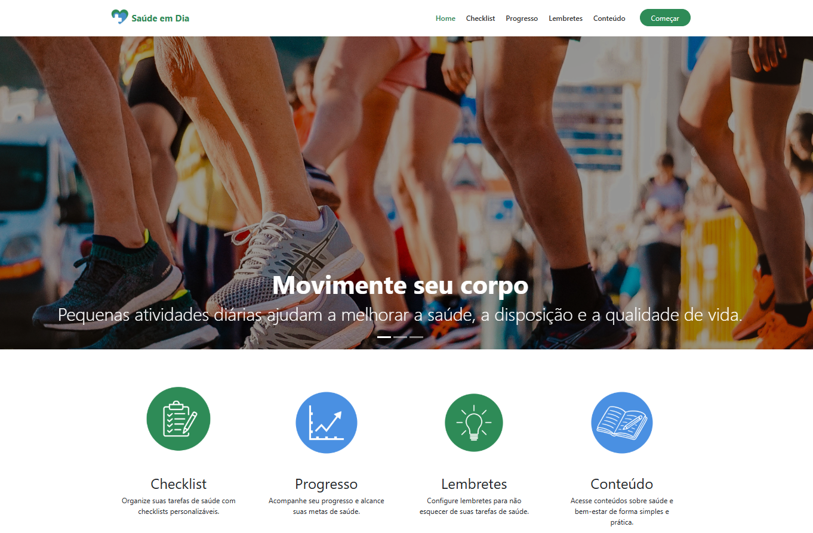

<h1><strong>Saúde em Dia</strong></h1>

<h2><strong>Descrição</strong></h2>

  O <strong>Saúde em Dia</strong> é um projeto com o objetivo de promover o cuidado em saúde por meio de uma plataforma digital prática, acessível e intuitiva. A proposta do sistema é incentivar hábitos saudáveis e facilitar o acompanhamento da rotina de bem-estar, oferecendo recursos como checklist de hábitos, painel de progresso, agendamentos de saúde e conteúdos informativos.

  O projeto foi pensado para apoiar usuários na organização de sua rotina de autocuidado, reunindo ferramentas que contribuem para a melhoria da qualidade de vida e para o acesso mais simples a informações relacionadas à saúde e ao bem-estar.

<h2><strong>Funcionalidades</strong></h2>
<ul>
  <li align="justify"><strong>Checklist de Hábitos</strong>, para acompanhamento de práticas saudáveis no dia a dia.</li>
  <li align="justify"><strong>Painel de Progresso</strong>, permitindo visualizar a evolução dos hábitos e do cuidado pessoal.</li>
  <li align="justify"><strong>Agendamentos de Saúde</strong>, organizando compromissos e lembretes importantes.</li>
  <li align="justify"><strong>Conteúdos Informativos</strong>, com materiais sobre saúde, bem-estar e autocuidado.</li>
  <li align="justify"><strong>Interface Responsiva</strong>, adaptada para diferentes tamanhos de tela.</li>
</ul>

<h2><strong>Demonstração do Projeto</strong></h2>

  
  
   
  <a href="https://saude-em-dia-chi.vercel.app/" target="_blank"><strong>Acesse a demonstração</strong></a>

<h2><strong>Tecnologias Utilizadas</strong></h2>
<ul>
  <li align="justify"><a href="https://developer.mozilla.org/pt-BR/docs/Web/HTML" target="_blank"><strong>HTML</strong></a>: utilizado para estruturar semanticamente as páginas da aplicação.</li>
  <li align="justify"><a href="https://developer.mozilla.org/pt-BR/docs/Web/CSS" target="_blank"><strong>CSS</strong></a>: responsável pela estilização visual, organização do layout e responsividade.</li>
  <li align="justify"><a href="https://developer.mozilla.org/pt-BR/docs/Web/JavaScript" target="_blank"><strong>JavaScript</strong></a>: usado para adicionar interatividade e dinamismo às funcionalidades da plataforma.</li>
  <li align="justify"><a href="https://getbootstrap.com/" target="_blank"><strong>Bootstrap</strong></a>: framework CSS utilizado para acelerar a construção da interface e melhorar a responsividade.</li>
  <li align="justify"><a href="https://vercel.com/" target="_blank"><strong>Vercel</strong></a>: plataforma de implantação utilizada para hospedar a aplicação.</li>
</ul>

<h2><strong>Estrutura do Projeto</strong></h2>

A estrutura do projeto está organizada da seguinte forma:

<pre><code>
saude-em-dia/
├── assets/    # Imagens, ícones e outros recursos visuais
│
├── js/
│   ├── main.js
│   ├── checklist.js
│   ├── lembretes.js
│   ├── conteudos.js
│   └── progresso.js
│
├── css/
│   ├── style.css
│   ├── checklist.css
│   ├── lembretes.css
│   ├── conteudos.css
│   └── progresso.css
│
├── video/
│   └── apresentacao.mp4
│
├── index.html
├── checklist.html
├── lembretes.html
├── conteudos.html
├── painel.html
├── README.md
└── grupo.txt
</code></pre>

<h2><strong>Instalação e Uso</strong></h2>
<ol>
  <li align="justify">Clone o repositório:
     
    <code>git clone https://github.com/williandpg/saude-em-dia.git</code>
  </li>
  <li align="justify">Acesse a pasta do projeto:
     
    <code>cd saude-em-dia</code>
  </li>
  <li align="justify">Abra o arquivo <code>index.html</code> diretamente no navegador ou utilize uma extensão como <strong>Live Server</strong> no VS Code.</li>
  <li align="justify">Navegue pelas páginas para explorar os recursos disponíveis na plataforma.</li>
</ol>

<h2><strong>Contribuição</strong></h2>
<ol>
  <li align="justify">Faça um fork do projeto.</li>
  <li align="justify">Crie uma branch para sua feature:
     
    <code>git checkout -b feature/minha-feature</code>
  </li>
  <li align="justify">Faça commit das alterações:
     
    <code>git commit -m "feat: adiciona nova funcionalidade"</code>
  </li>
  <li align="justify">Envie para o seu repositório remoto:
     
    <code>git push origin feature/minha-feature</code>
  </li>
  <li align="justify">Abra um Pull Request descrevendo as mudanças realizadas.</li>
</ol>

<h2><strong>Contato</strong></h2>

  <strong>Eduarda Silveira Lemos</strong> |
  <a href="" target="_blank"><strong>LinkedIn</strong></a> |
  <a href="https://github.com/EduardaSilveira04" target="_blank"><strong>GitHub</strong></a> |
  <a href="https://EduardaSilveira04.github.io/" target="_blank"><strong>Portfólio</strong></a> |
  <a href="mailto:" target="_blank"><strong>Email</strong></a>

  <strong>Rael Lima da Silva</strong> |
  <a href="" target="_blank"><strong>LinkedIn</strong></a> |
  <a href="https://github.com/Raellima7" target="_blank"><strong>GitHub</strong></a> |
  <a href="https://Raellima7.github.io/" target="_blank"><strong>Portfólio</strong></a> |
  <a href="mailto:" target="_blank"><strong>Email</strong></a>

  <strong>Vitor Theodoro da Fonseca</strong> |
  <a href="" target="_blank"><strong>LinkedIn</strong></a> |
  <a href="https://github.com/vtzada" target="_blank"><strong>GitHub</strong></a> |
  <a href="https://vtzada.github.io/" target="_blank"><strong>Portfólio</strong></a> |
  <a href="mailto:" target="_blank"><strong>Email</strong></a>

  <strong>Willian Gonçalves</strong> |
  <a href="https://www.linkedin.com/in/williandpg/" target="_blank"><strong>LinkedIn</strong></a> |
  <a href="https://github.com/williandpg" target="_blank"><strong>GitHub</strong></a> |
  <a href="https://williandpg.github.io/" target="_blank"><strong>Portfólio</strong></a> |
  <a href="mailto:goncalves.wdp@outlook.com" target="_blank"><strong>Email</strong></a>

<h2><strong>Créditos</strong></h2>

  Este projeto foi desenvolvido como parte da disciplina de <strong>Desenvolvimento Web</strong> ministrada pela Unisinos, com foco na criação de uma solução digital voltada à promoção do cuidado em saúde, bem-estar e hábitos saudáveis.

  
<strong>English Version</strong>

  <h1><strong>Saúde em Dia</strong></h1>

  <h2><strong>Description</strong></h2>
  

    <strong>Saúde em Dia</strong> is a project with the goal of promoting health care through a practical, accessible and intuitive digital platform. The system was designed to encourage healthy habits and make wellness tracking easier by offering features such as habit checklists, progress dashboards, health scheduling and informative health-related content.
  

  

    The project aims to support users in organizing their self-care routine, bringing together tools that contribute to a better quality of life and simpler access to health and wellness information.
  

  <h2><strong>Features</strong></h2>
  <ul>
    <li align="justify"><strong>Habit Checklist</strong> to track healthy daily practices.</li>
    <li align="justify"><strong>Progress Dashboard</strong> to visualize personal health and habit evolution.</li>
    <li align="justify"><strong>Health Scheduling</strong> to organize important appointments and reminders.</li>
    <li align="justify"><strong>Informative Content</strong> focused on health, wellness and self-care.</li>
    <li align="justify"><strong>Responsive Interface</strong> adapted to different screen sizes.</li>
  </ul>

  <h2><strong>Project Demonstration</strong></h2>
  

    
    
     
    <a href="https://saude-em-dia-chi.vercel.app/" target="_blank"><strong>Access the live demo</strong></a>
  

  <h2><strong>Technologies Used</strong></h2>
  <ul>
    <li align="justify"><a href="https://developer.mozilla.org/en-US/docs/Web/HTML" target="_blank"><strong>HTML</strong></a>: used to create the semantic structure of the pages.</li>
    <li align="justify"><a href="https://developer.mozilla.org/en-US/docs/Web/CSS" target="_blank"><strong>CSS</strong></a>: responsible for styling, layout organization and responsiveness.</li>
    <li align="justify"><a href="https://developer.mozilla.org/en-US/docs/Web/JavaScript" target="_blank"><strong>JavaScript</strong></a>: used to add interactivity and dynamic behavior to the platform.</li>
    <li align="justify"><a href="https://getbootstrap.com/" target="_blank"><strong>Bootstrap</strong></a>: CSS framework used to speed up interface development and improve responsiveness.</li>
    <li align="justify"><a href="https://vercel.com/" target="_blank"><strong>Vercel</strong></a>: deployment platform used to host the application.</li>
  </ul>

  <h2><strong>Project Structure</strong></h2>
  
The project structure is organized as follows:

  <pre><code>
  saude-em-dia/
  ├── assets/    # Images, icons and other visual resources
  │
  ├── js/
  │   ├── main.js
  │   ├── checklist.js
  │   ├── lembretes.js
  │   ├── conteudos.js
  │   └── progresso.js
  │
  ├── css/
  │   ├── style.css
  │   ├── checklist.css
  │   ├── lembretes.css
  │   ├── conteudos.css
  │   └── progresso.css
  │
  ├── video/
  │   └── apresentacao.mp4
  │
  ├── index.html
  ├── checklist.html
  ├── lembretes.html
  ├── conteudos.html
  ├── painel.html
  ├── README.md
  └── grupo.txt
  </code></pre>

  <h2><strong>Installation and Usage</strong></h2>
  <ol>
    <li align="justify">Clone the repository:
       
      <code>git clone https://github.com/williandpg/saude-em-dia.git</code>
    </li>
    <li align="justify">Open the project folder:
       
      <code>cd saude-em-dia</code>
    </li>
    <li align="justify">Open the <code>index.html</code> file directly in your browser or use an extension such as <strong>Live Server</strong> in VS Code.</li>
    <li align="justify">Navigate through the pages to explore the platform features.</li>
  </ol>

  <h2><strong>Contribution</strong></h2>
  <ol>
    <li align="justify">Fork the project.</li>
    <li align="justify">Create a feature branch:
       
      <code>git checkout -b feature/my-feature</code>
    </li>
    <li align="justify">Commit your changes:
       
      <code>git commit -m "feat: add new feature"</code>
    </li>
    <li align="justify">Push the branch to your remote repository:
       
      <code>git push origin feature/my-feature</code>
    </li>
    <li align="justify">Open a Pull Request describing your changes.</li>
  </ol>

  <h2><strong>Contact</strong></h2>
  

    <strong>Eduarda Silveira Lemos</strong> |
    <a href="" target="_blank"><strong>LinkedIn</strong></a> |
    <a href="https://github.com/EduardaSilveira04" target="_blank"><strong>GitHub</strong></a> |
    <a href="https://EduardaSilveira04.github.io/" target="_blank"><strong>Portfólio</strong></a> |
    <a href="mailto:" target="_blank"><strong>Email</strong></a>
  

  

    <strong>Rael Lima da Silva</strong> |
    <a href="" target="_blank"><strong>LinkedIn</strong></a> |
    <a href="https://github.com/Raellima7" target="_blank"><strong>GitHub</strong></a> |
    <a href="https://Raellima7.github.io/" target="_blank"><strong>Portfólio</strong></a> |
    <a href="mailto:" target="_blank"><strong>Email</strong></a>
  

  

    <strong>Vitor Theodoro da Fonseca</strong> |
    <a href="" target="_blank"><strong>LinkedIn</strong></a> |
    <a href="https://github.com/vtzada" target="_blank"><strong>GitHub</strong></a> |
    <a href="https://vtzada.github.io/" target="_blank"><strong>Portfólio</strong></a> |
    <a href="mailto:" target="_blank"><strong>Email</strong></a>
  

  

    <strong>Willian Gonçalves</strong> |
    <a href="https://www.linkedin.com/in/williandpg/" target="_blank"><strong>LinkedIn</strong></a> |
    <a href="https://github.com/williandpg" target="_blank"><strong>GitHub</strong></a> |
    <a href="https://williandpg.github.io/" target="_blank"><strong>Portfólio</strong></a> |
    <a href="mailto:goncalves.wdp@outlook.com" target="_blank"><strong>Email</strong></a>
  

  <h2><strong>Credits</strong></h2>
  

    This project was developed as part of the <strong>Web Development</strong> course ministrated by Unisinos, focusing on the creation of a digital solution aimed at health care, wellness and healthy habits.
  

