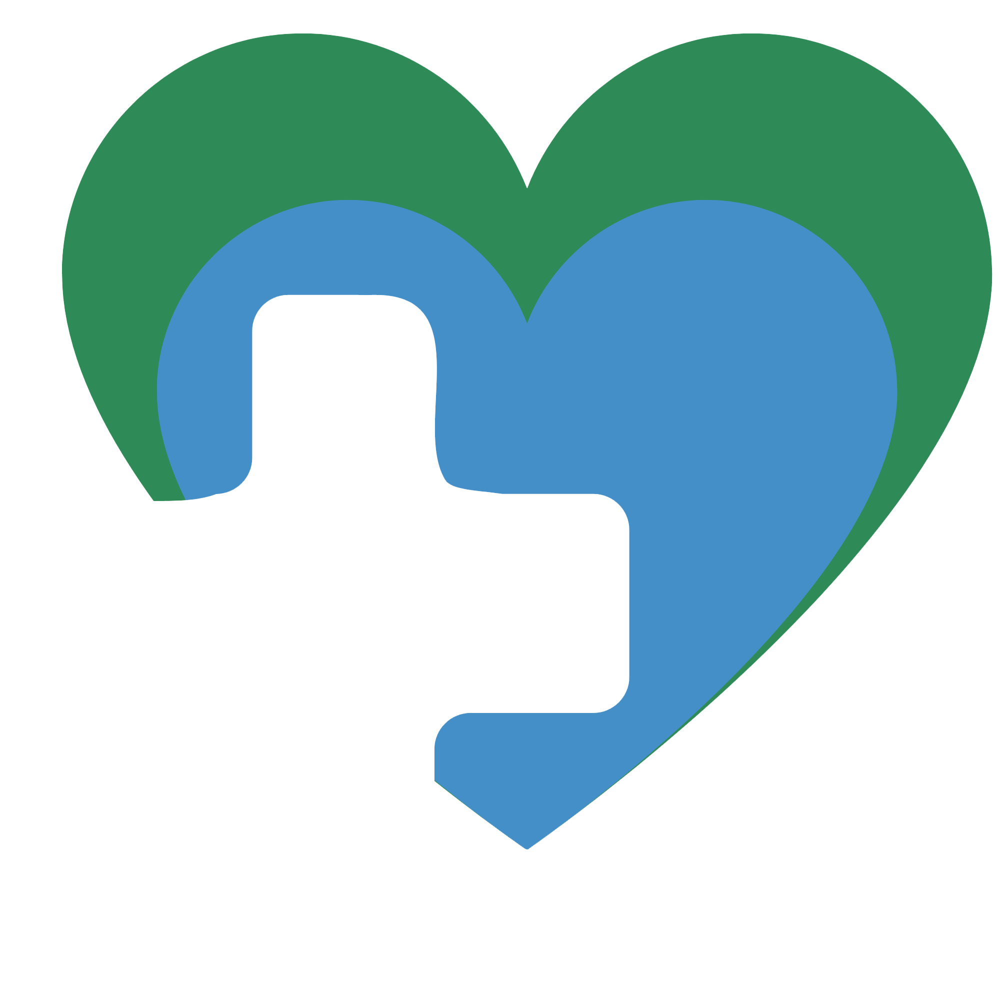

# saude-em-dia
Projeto do grupo 23 para disciplina de Desenvolvimento Web

# Descrição do tema proposto
## Cuidado em Saúde
O cuidado em saúde é uma ação integral fruto do 'entre-relações' de pessoas, ou seja, ação integral como efeitos e repercussões de interações positivas entre usuários, profissionais e instituições, que são traduzidas em atitudes, tais como: tratamento digno e respeitoso, com qualidade, acolhimento e vínculo.
Fonte: FioCruz

## Projeto proposto
O projeto "Saúde em Dia" tem como objetivo promover o cuidado em saúde por meio de uma plataforma digital que oferece recursos e ferramentas para auxiliar os usuários a manterem hábitos saudáveis e acompanharem sua saúde de forma prática e acessível. A plataforma contará com funcionalidades como checklist de hábitos, painel de acompanhamento, agendamentos de saúde e conteúdos informativos sobre saúde e bem-estar. O foco do projeto é incentivar a adoção de hábitos saudáveis e facilitar o acesso a informações e serviços relacionados à saúde, contribuindo para a melhoria da qualidade de vida dos usuários.

# Telas do projeto
- Home
- Checklist de habitos
- Painel de acompanhamento
- Agendamentos de saúde
- Conteudos sobre os habitos e saude

# Tecnologias utilizadas
- HTML
- CSS
- JavaScript
- Bootstrap

# Como contribuir
1. Clone este repositório
2. Crie uma branch para sua feature (`git checkout -b feature/nome-da-feature`)
3. Faça commit das suas alterações (`git commit -m 'Adiciona nova feature')
4. Push para a branch (`git push origin feature/nome-da-feature`)
5. Abra um Pull Request

# Estrutura de arquivos recomendada
```
saude-em-dia/
│
├── index.html
├── checklist.html
├── lembretes.html
├── conteudos.html
├── painel.html
│
├── css/
│   ├── style.css
│   ├── home.css
│   ├── checklist.css
│   ├── lembretes.css
│   ├── conteudos.css
│   └── painel.css
│
├── js/
│   ├── main.js
│   ├── checklist.js
│   ├── lembretes.js
│   ├── conteudos.js
│   └── painel.js
│
├── assets/
│   ├── img/
│   └── icons/
│
├── video/
│   └── apresentacao.mp4
│
└── grupo.txt
```

Navbar para todas as páginas:
```html
<nav class="navbar navbar-expand-lg bg-white shadow-sm py-3">
  <div class="container">
    <a class="navbar-brand d-flex align-items-center fw-bold" href="#" style="color: #2E8B57;">
      
      Saúde em Dia
    </a>
    <button class="navbar-toggler" type="button" data-bs-toggle="collapse" data-bs-target="#navbarNav"
      aria-controls="navbarNav" aria-expanded="false" aria-label="Alternar navegação">
      <span class="navbar-toggler-icon"></span>
    </button>
    <div class="collapse navbar-collapse" id="navbarNav">
      <ul class="navbar-nav ms-auto align-items-lg-center gap-lg-2">
        <li class="nav-item">
          <a class="nav-link active fw-semibold" href="#">Home</a>
        </li>
        <li class="nav-item">
          <a class="nav-link" href="/checklist.html">Checklist</a>
        </li>
        <li class="nav-item">
          <a class="nav-link" href="/progresso.html">Progresso</a>
        </li>
        <li class="nav-item">
          <a class="nav-link" href="/lembretes.html">Lembretes</a>
        </li>
        <li class="nav-item">
          <a class="nav-link" href="/conteudo.html">Conteúdo</a>
        </li>
        <li class="nav-item mt-3 mt-lg-0 ms-lg-3">
          <a class="btn btn-success rounded-pill px-4" href="/checklist.html">Começar</a>
        </li>
      </ul>
    </div>
  </div>
</nav>
```

Footer para todas as páginas:
```html
<footer class="bg-dark text-white pt-5 pb-3 mt-5">
  <div class="container">
    <div class="row g-4">
      <div class="col-12 col-md-6 col-lg-4">
        <h5 class="fw-bold mb-3" style="color: #7CFC98;">Saúde em Dia</h5>
        <p class="mb-0">
          Uma aplicação web desenvolvida para incentivar hábitos saudáveis, organização da rotina
          e acesso a informações de bem-estar e autocuidado.
        </p>
      </div>
      <div class="col-6 col-md-3 col-lg-2">
        <h6 class="fw-bold mb-3">Navegação</h6>
        <ul class="list-unstyled">
          <li><a href="#" class="text-white text-decoration-none">Home</a></li>
          <li><a href="/checklist.html" class="text-white text-decoration-none">Checklist</a></li>
          <li><a href="/progresso.html" class="text-white text-decoration-none">Progresso</a></li>
          <li><a href="/lembretes.html" class="text-white text-decoration-none">Lembretes</a></li>
          <li><a href="/conteudo.html" class="text-white text-decoration-none">Conteúdo</a></li>
        </ul>
      </div>
      <div class="col-6 col-md-3 col-lg-3">
        <h6 class="fw-bold mb-3">Contato</h6>
        <ul class="list-unstyled mb-0">
          <li class="mb-2">Email: contato@saudeemdia.com</li>
          <li class="mb-2">Telefone: (51) 12345-6789</li>
          <li>Rio Grande do Sul, Brasil</li>
        </ul>
      </div>
      <div class="col-12 col-md-6 col-lg-3">
        <h6 class="fw-bold mb-3">Integrantes</h6>
        <ul class="list-unstyled mb-0">
          <li>Eduarda Silveira Lemos</li>
          <li>Rael Lima da Silva</li>
          <li>Vitor Theodoro da Fonseca</li>
          <li>Willian de Paula Gonçalves</li>
        </ul>
      </div>
    </div>
    <hr class="border-light my-4">
    <div class="d-flex flex-column flex-md-row justify-content-between align-items-center text-center text-md-start">
      <p class="mb-2 mb-md-0">&copy; 2026 Saúde em Dia. Todos os direitos reservados.</p>
      <p class="mb-0">Projeto acadêmico do grupo 23 da disciplina de Desenvolvimento Web.</p>
    </div>
  </div>
</footer>
```

CSS para navbar e footer (adicionar ao style.css):
```css
.navbar-brand {
  font-size: 1.4rem;
}

.navbar .nav-link {
  color: #333;
  font-weight: 500;
  transition: 0.3s ease;
}

.navbar .nav-link:hover {
  color: #2E8B57;
}

.navbar .nav-link.active {
  color: #2E8B57 !important;
}

.navbar .btn-success {
  background-color: #2E8B57;
  border-color: #2E8B57;
  transition: 0.3s ease;
}

.navbar .btn-success:hover {
  background-color: #256f46;
  border-color: #256f46;
}

footer {
  background-color: #1F2937;
  color: #F5F7FA;
  padding: 20px 0;
}

footer a {
  transition: 0.3s ease;
}

footer a:hover {
  color: #7CFC98 !important;
}

footer ul li {
  margin-bottom: 0.4rem;
}
```

